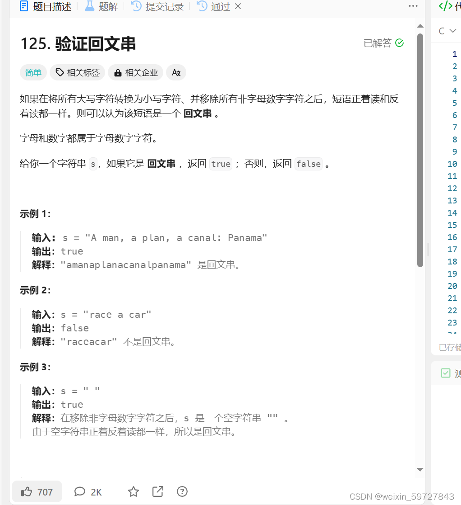

# 技巧 双指针

> 原创 已于 2023-11-19 00:21:42 修改 · 公开 · 171 阅读 · 1 · 0 · 本内容遵循CC 4.0 BY-SA版权协议 版权声明：本文为博主原创文章，遵循 CC 4.0 BY-SA 版权协议，转载请附上原文出处链接和本声明。 GEO检测 · 编辑
> 文章链接：https://blog.csdn.net/weixin_59727843/article/details/134354619

## 技巧 双指针

#### 首先什么是双指针

(我们这里的指针并不是指向地址的指针而是数组的下标指针)双指针是利用数组的多个数组下标同时移动而减小遍历数组次数的一种技巧

#### 双指针的运用场景

双指针的运用在数组,字符串中运用广泛,是学习算法的必学技巧

分为左右指针和快慢指针

我们将探讨的是左右指针

快慢指针在追赶问题以及滑动窗口中应用广泛

#### 双指针详解(以回文串为例LeetCode125题)

 

由题意我们需将原字符串中的我们需要的字符放在另一个字符串中防止其他的符号干扰我们的判断

所以我们拷贝我们需要的字符串

```cobol
sgood=(char*)malloc(sizeof(char)*(strlen(s)+sizeof(char)));
for(i=0;i<strlen(s);i++){
    if(s[i]>='A'&&s[i]<='Z'){
        s[i]+=32;
    }
    if((s[i]>='a'&&s[i]<='z')||(s[i]>='0'&&s[i]<='9')){
        sgood[j++]=s[i];
    }
}
sgood[j]='\0';
```

然后我们利用双指针left,right分别从字符串的开头和结尾开始比较,如果sgood[left]==sgood[right]相同,就left++;right--;直到两指针相遇或者差值为1(字符串长度为偶数或者奇数);然后返回ture,如果在比较的时候有一对不相等即sgood[left]!=sgood[right]就返回false

```cobol
int len=strlen(sgood);
int left=0,right=len-1;
while(left<right&&left<len&&right>0){
    if(sgood[left]!=sgood[right]){
        return false; 
    }
    left++;
    right--;
}
return true;
}
```

下面给出完整代码

```cobol
bool isPalindrome(char * s){
int i;
int j=0;
char *sgood;
sgood=(char*)malloc(sizeof(char)*(strlen(s)+sizeof(char)));
for(i=0;i<strlen(s);i++){
    if(s[i]>='A'&&s[i]<='Z'){
        s[i]+=32;
    }
    if((s[i]>='a'&&s[i]<='z')||(s[i]>='0'&&s[i]<='9')){
        sgood[j++]=s[i];
    }
}
sgood[j]='\0';
int len=strlen(sgood);
int left=0,right=len-1;
while(left<right&&left<len&&right>0){
    if(sgood[left]!=sgood[right]){
        return false; 
    }
    left++;
    right--;
}
return true;
}
```


#### 总结

双指针是一个简单,高效,常用的算法技巧是每个程序员必备的技巧