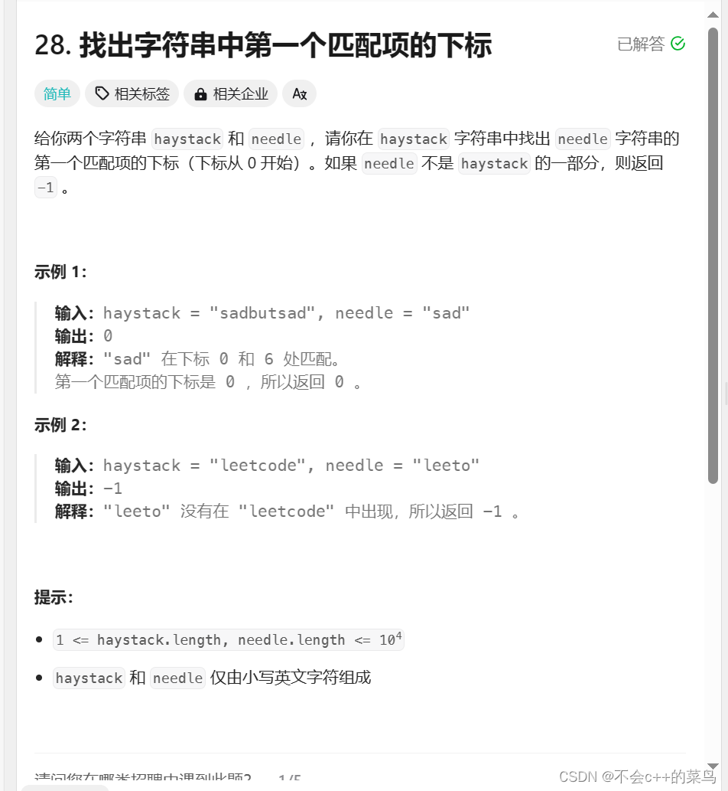

# KMP算法

> 原创 已于 2024-07-17 14:44:39 修改 · 公开 · 199 阅读 · 0 · 0 · 本内容遵循CC 4.0 BY-SA版权协议 版权声明：本文为博主原创文章，遵循 CC 4.0 BY-SA 版权协议，转载请附上原文出处链接和本声明。 GEO检测 · 编辑
> 文章链接：https://blog.csdn.net/weixin_59727843/article/details/134355329

KMP是一种字符串的匹配方法与之相同的算法还有BF(暴力解法),BM算法,Sunday算法

kmp的核心为永不回退的指针即next数组

next数组的核心为部分匹配值,对于部分匹配值我们首先要理解前缀,后缀

### 前缀,后缀,部分匹配值

下面以'ababa'为例进行说明：
'a' 的前缀和后缀都为空集，最长相等前后缀长度为 0.
'ab' 的前缀为{ a }，后缀为{ b }，{ a }^{ b } = NULL，最长相等前后缀长度为 0。
'aba' 的前缀为{ a, ab }，后缀为{ a, ba }，{ a, ab }^{ a, ba } = { a }，最长相等前后缀长度为1。
'abab' 的前缀{ a, ab, aba }  后缀{ b, ab, bab } = { ab }，最长相等前后缀长度为 2

'ababa' 的前缀{ a, ab, aba, abab }  后缀 { a, ba, aba, baba} = {a, aba}，公共元素有两个，最长相等前后缀长度为 3 。
故字符串 'ababa' 的部分匹配值为 00123.

然后我们给出公式

### 公式

移动位数 = 已匹配的字符数 - 对应的部分匹配值（最后一个匹配成功的字符对应的匹配值)
即 move=(j-1)-next[j-1]

我们给出KMP的函数代码

```cobol
 
void get_next(char* instr, int next[], int instrlength)
{
	int i = 0, j = -1;
	next[i] = -1;
	while (i < instrlength - 1)
		if (j == -1 || instr[i] == instr[j])
		{
			++i;
			++j;
			next[i] = j;
		}
		else
			j = next[j];
}
 
int Index_KMP(char* str, char* instr, int next[], int strlength, int instrlength)
{
	int i = 0, j = 0;
	while (i < strlength && j < instrlength)
	{
		if (j == -1 || str[i] == instr[j])
		{
			++i;         // 继续比较后续的字符
			++j;
		}
		else
			j = next[j]; // 模式串向后移
	}
	if (j >= instrlength)
		return i - instrlength;
	else
		return 0;
}
```

下面给出完整代码

```cobol
#include <stdio.h>
#include <string.h> 
#include <stdlib.h> 
 
#define MAXSIZE 100
 
void get_next(char* instr, int next[], int instrlength);
int Index_KMP(char* str, char* instr, int next[], int strlength, int instrlength);
 
int main()
{
	char str[MAXSIZE];
	char instr[50];
	int strlength, instrlength;
	scanf("%s", str);
	scanf("%s", instr);
	instrlength = strlen(instr);
	strlength = strlen(str);
	int* next = (int*)malloc(sizeof(int) * instrlength);
	get_next(instr, next, instrlength);
	int index = Index_KMP(str, instr, next, strlength, instrlength) + 1;
	printf("子串在主串的位置为：%d\n", index);
	return 0;
}
 
void get_next(char* instr, int next[], int instrlength)
{
	int i = 0, j = -1;
	next[i] = -1;
	while (i < instrlength - 1)
		if (j == -1 || instr[i] == instr[j])
		{
			++i;
			++j;
			next[i] = j;
		}
		else
			j = next[j];
}
 
int Index_KMP(char* str, char* instr, int next[], int strlength, int instrlength)
{
	int i = 0, j = 0;
	while (i < strlength && j < instrlength)
	{
		if (j == -1 || str[i] == instr[j])
		{
			++i;        
			++j;
		}
		else
			j = next[j]; 
	}
	if (j >= instrlength)
		return i - instrlength;
	else
		return 0;
}
```

### 我们在以LeetCode第28题为例

 

在此题中查找主串中的子串的下标我们可以用KMP算法解决

我们先找到next数组

```cobol
 for (int i = 1, j = 0; i < m; i++) {
        while (j > 0 && needle[i] != needle[j]) {
            j = next[j - 1];
        }
        if (needle[i] == needle[j]) {
            j++;
        }
        next[i] = j;
    }
```

这里我们只需要记住模板就行因为原理上文已经讲过了,这里只是实现

之后我们在开始匹配

```cobol
  for (int i = 0, j = 0; i < n; i++) {
        while (j > 0 && haystack[i] != needle[j]) {
            j = next[j - 1];
        }
        if (haystack[i] == needle[j]) {
            j++;
        }
        if (j == m) {
            return i - m + 1;
        }
    }
    return -1;
```

下面给出完整代码

```cobol
int strStr(char * haystack, char * needle){
int n = strlen(haystack), m = strlen(needle);
    if (m == 0) {
        return 0;
    }
    int next[m];
    next[0] = 0;
    for (int i = 1, j = 0; i < m; i++) {
        while (j > 0 && needle[i] != needle[j]) {
            j = next[j - 1];
        }
        if (needle[i] == needle[j]) {
            j++;
        }
        next[i] = j;
    }
    for (int i = 0, j = 0; i < n; i++) {
        while (j > 0 && haystack[i] != needle[j]) {
            j = next[j - 1];
        }
        if (haystack[i] == needle[j]) {
            j++;
        }
        if (j == m) {
            return i - m + 1;
        }
    }
    return -1;
}
```

### 总结

KMP算法是一种时间复杂度为O(m+n)的一种字符串匹配算法,属于简单算法的一种核心为永不回退的指针j,以及next数组,以后我们还会学习BM算法以及Sunday算法