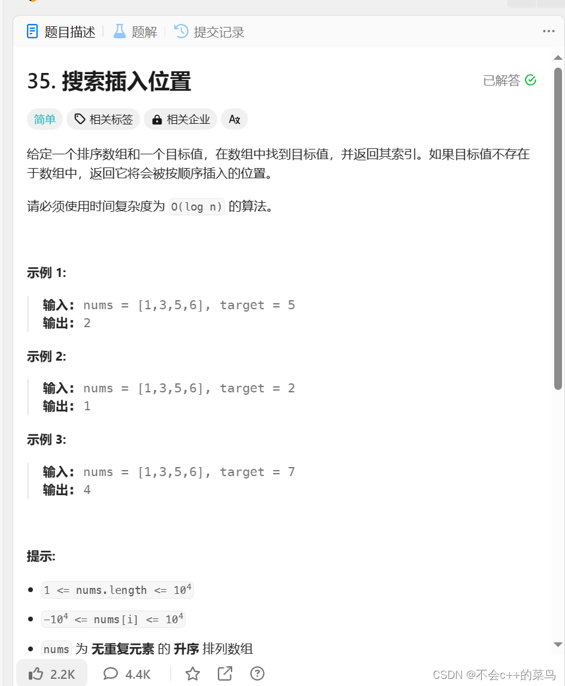

# 二分查找

> 原创 已于 2024-07-17 14:44:10 修改 · 公开 · 118 阅读 · 0 · 0 · 本内容遵循CC 4.0 BY-SA版权协议 版权声明：本文为博主原创文章，遵循 CC 4.0 BY-SA 版权协议，转载请附上原文出处链接和本声明。 GEO检测 · 编辑
> 文章链接：https://blog.csdn.net/weixin_59727843/article/details/134485803

### 什么叫二分查找

二分查找即将我们要查找的一组数据(有序)每次都比较这组数据(我们每次查找后会更新数据)的最小值与最大值来更新数据区间

我们举一个很简单的例子

### 猜数字游戏

我们在100以内猜数字

比如target为30;我们该怎么猜呢?

#### 方法一

从1直猜到30,总共猜了30次

#### 方法二

从50开始猜,(1和100的中位数)然后得到答案大了,于是我们从1到50开始猜,我们猜25,得到答案,小了于是我们从25到50开始猜,我们猜(25+50)/2=37(都是整数,我们取整,向上还是向下没有影响)

一直这样猜,我们5次就可以将答案猜出来,这就是二分查找

### 下面给出例题(LeetCode第35题)

 

由于nums为无重复元素的升序排列数组所以我们容易想到二分查找

我们令left=0;right=len(nums)-1,middle=(right-left)>>1(即left和right的中间值,用位运算会快一点)然后比较target与nums[middle]的值的大小如果等于middle就找到了,如果大于middle 就让left=middle;

然后计算middle的值,继续比较知道找到为止(如果小于middle就让right=middle其他的同上)

这道题还有种情况是target不在数组中,我们需要找到target的位置,这其实也是二分不过我们要在里面加一点判断罢了,下面给出完整代码

```cpp
int searchInsert(int* nums, int numsSize, int target) {
    int left = 0, right = numsSize - 1, ans = numsSize;
    while (left <= right) {
        int mid = ((right - left) >> 1) + left;
        if (target <= nums[mid]) {
            ans = mid;
            right = mid - 1;
        } else {
            left = mid + 1;
        }
    }
    return ans;
}
```

### 下面给出模板

```cpp
​
int Binary Search(int *nums,int numSize,int target){
     int left=0;right=numSize-1;
     while(left<right){
     int middle=(right-left)>>1+left;
     if(nums[middle]==target){
          return middle-1;\\下标
     }
     if(nums[middle]<target){
          left=middle+1\\middle已结判断过了
     }
     if(nums[middle]>target){
          right=middle-1;\\middle已结判断过了
     }
    }
   return -1\\没找到
}
 
​
```

### 总结

二分查找的时间复杂度为O(log n)比遍历数组的O(n)要快,所以我们应该熟练掌握二分查找这种算法