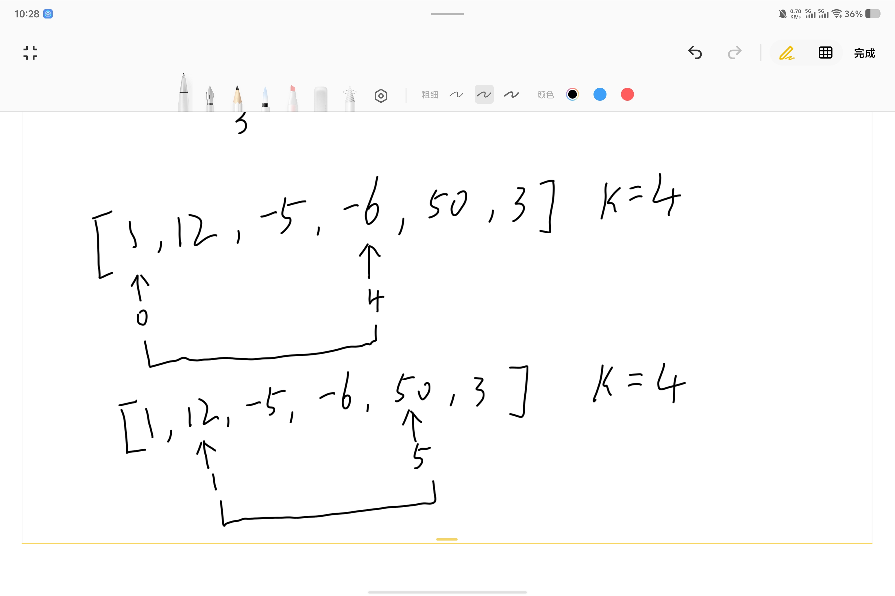

# 算法----滑动窗口

> 原创 已于 2025-08-15 10:37:44 修改 · 公开 · 412 阅读 · 4 · 7 · 本内容遵循CC 4.0 BY-SA版权协议 版权声明：本文为博主原创文章，遵循 CC 4.0 BY-SA 版权协议，转载请附上原文出处链接和本声明。 GEO检测 · 编辑
> 文章链接：https://blog.csdn.net/weixin_59727843/article/details/150415751

## 滑动窗口

### 什么是滑动窗口

滑动窗口是一种常用的技术，主要用于处理连续数据序列（如数组、字符串或时间序列数据），通过动态调整一个固定大小的“窗口”来高效地解决问题。窗口在序列上“滑动”，每次移动一个位置，从而避免重复计算，优化时间和空间复杂度。该技术在算法设计、网络通信、数据分析等领域有广泛应用。

### 示例

我们通过一道题来学习滑动窗口
 

首先我们阅读题目,思考三个部分内容

- 已知条件

- 求什么

- 关键字
  已知条件为n个元素大小的数组,和一个整数k
  求平均数
  关键字: `平均数最大` , `长度为k` , `连续子数组` 
  这里,长度为k就是窗口大小为k,我们以第一个例子[1,12,-5,-6,50,3] k = 4为例子

### 步骤

- 确定窗口大小

- 确定窗口的起点,终点

- 确定元素进入,离开窗口时的状态

- 更新窗口的状态

- 得到答案
  这道题中大小为k,起点为0,终点为数组大小,元素进入和离开窗口时都是不变的,那么这里最关键的一步就是怎么更新窗口的状态我们来详细讲解

- 看我们需要什么

- 在窗口中能得到什么

- 什么时候更新窗口的元素

- 怎么更新窗口的元素
  由题意不难得知我们需要窗口中元素的和(k固定,得到和就得到平均数)
  我们能在窗口中得到每个元素的值
  当我们计算完和之后就可以更新窗口的值
  由题意由于是定长k,并且求k这个窗口中sum的最大值,我们不难发现只需要每次让窗口向前移动一位就行
  那么这道题的思考就完成了,下面看图解
   

  这里0 - 4是第一个窗口,我们可以得到0 - 4这个窗口的和为2,平均值为0.5
  这时我们移动窗口,让窗口到1 - 5这时和为51,以此类推,到了最后到达2,6后此时窗口的尾指针到达数组边界,此时滑动窗口结束

### 代码

```rust
 pub fn find_max_average(nums: Vec<i32>, k: i32) -> f64 {
        //计算第一次平均值
        let avg_and_sum = Self::average(&nums, 0, k);
        let mut avg = avg_and_sum.0;
        let mut sum = avg_and_sum.1;
        let mut res = avg;
        for i in 1..nums.len() {
            if i + k as usize > nums.len() {
                break;
            }
            sum -= nums[i - 1];
            sum += nums[i + k  as usize -1];
            avg = sum as f64 / k as f64;
            if res < avg {
                res = avg;
            }
        }
        res
    }

    fn average(nums: &Vec<i32>, start: i32, end: i32) -> (f64, i32) {
        let mut sum = 0.0;
        for i in start..end {
            sum += nums[i as usize] as f64;
        }
        (sum / (end - start) as f64, sum as i32)
    }
```