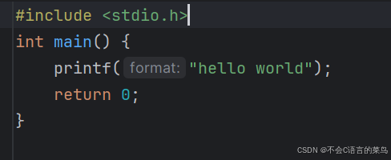
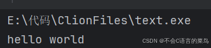

# C语言学习----基本语法

> 原创 于 2024-08-04 15:48:25 发布 · 公开 · 306 阅读 · 1 · 0 · 本内容遵循CC 4.0 BY-SA版权协议 版权声明：本文为博主原创文章，遵循 CC 4.0 BY-SA 版权协议，转载请附上原文出处链接和本声明。 GEO检测 · 编辑
> 文章链接：https://blog.csdn.net/weixin_59727843/article/details/140906867

## 文件格式

### 1.预编译命令

在每一个文件的开头，都会导入头文件，头文件中包含了很多常用的函数，包括输入输出，比较大小等函数。

```cpp
​
#include<stdio.h>
#include<stdlib.h>
#include<stdbool.h>
#include<math.h>
#include<limits.h>
 
​
```

等等

### 2.主函数

主函数是程序的入口，每个程序都是从主函数开始运行

```cpp
int main(){
  //语句
  return 0；
}
```

每个程序都必须有主函数

### 3.返回值

在主函数结束时需要返回0

```cpp
return 0；
```

## 语句要求

除了预编译命令和括号后面，每个语句都要以分号结尾

```cpp
int a=0;
double b=0;
printf("hello world");
```

## 完整的C语言程序演示

```cpp
#include<stdio.h>
int main(){
  printf("hello world");
  return 0;
}
```

<div style="text-align:center;"></div>