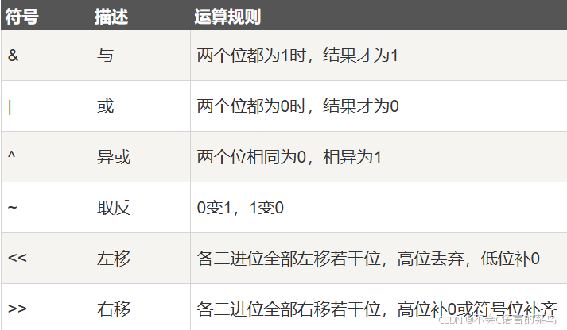

# C语言学习----运算符

> 原创 于 2024-08-04 16:27:13 发布 · 公开 · 490 阅读 · 4 · 7 · 本内容遵循CC 4.0 BY-SA版权协议 版权声明：本文为博主原创文章，遵循 CC 4.0 BY-SA 版权协议，转载请附上原文出处链接和本声明。 GEO检测 · 编辑
> 文章链接：https://blog.csdn.net/weixin_59727843/article/details/140907207

### 1.算数运算符：

+，-，*，/ ,%加减乘除取余

```cpp
int a=1;
int b=2;
printf("%d",a+b);//3
printf("%d",a-b);//-1
printf("%d",a*b);//2
printf("%f",a/b);//0.5;
printf("%d",a%b);//1
```


### 2.关系运算符：

>,<,==,>=,<=,!= 大于，小于，等于，大于等于，小于等于，不等于

关系运算符的运算结果为bool值。

```cpp
int a=1;
int b=2;
printf("%d",a>b);//0
printf("%d",a<b);//1
printf("%d",a==b);//0
printf("%d",a>=b);//0
printf("%d",a<=b);//1
printf("%d",a!=b);//0
```

### 3.逻辑运算符：

&&，||，！，与，或，非

逻辑运算符的对象是bool值

```cpp
bool a=true;
bool b=false;
printf("%d",a&&b);//0
printf("%d",a||b);//1
printf("%d",!a);//0
printf("%d",!b);//1
printf("%d",a&&a);//1
printf("%d",b&&b);//0
printf("%d",a||a);//1
printf("%d",b||b);//0
```

a&&b，a和b有一个为false则为false

a||b，a和b有一个为true则为true

!a,取反，a为true，则!a为false

### 4.位运算符：

&，|，^,与，或，异或，>>,<< ，~，右移，左移，取反

位运算符用于数字之间的运算（数字的二进制）

 

具体查看 [菜鸟教程](https://www.runoob.com/w3cnote/bit-operation.html) 

### 5.赋值运算符：

用于将一个值赋给变量，包括简单赋值（=）以及加等于（+=）、减等于（-=）、乘等于（*=）、除等于（/=）和取余等于（%=）等组合赋值运算符。

```cpp
int a=1;
int b=2;
a+=b;//等价于a=a+b;
printf("%d",a);//3
```

其他同理

### 6.自增，自减运算符：

++，--

```cpp
int a=1;
a++;//a=a+1;
printf("%d",a);//2
a--;//a=a-1;
printf("%d",a);//1
```

### 7.三元运算符：

格式：变量= bool表达式?如果是true赋值为多少：false 赋值为多少

```cpp
int a=0;
int b=1;
int max=a>b?a:b;
printf("%d",max);//1
```

文字解释，如果a大于b，max=a，否则max=b；