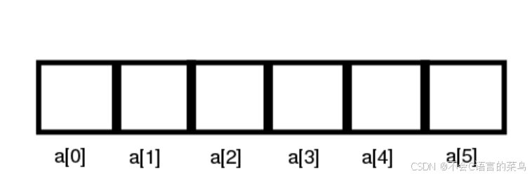
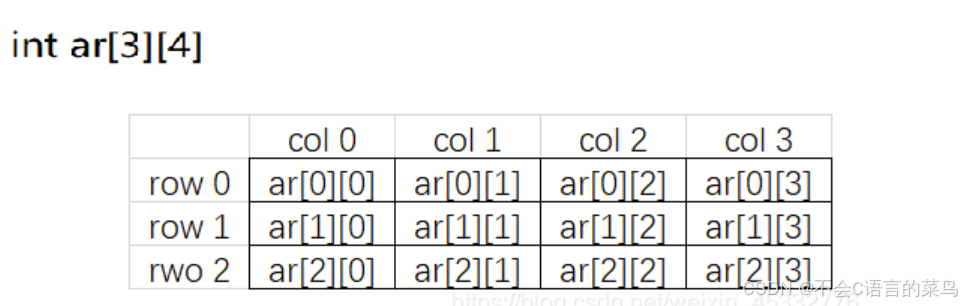

# C语言学习----数组

> 原创 已于 2024-08-14 12:02:07 修改 · 公开 · 428 阅读 · 6 · 5 · 本内容遵循CC 4.0 BY-SA版权协议 版权声明：本文为博主原创文章，遵循 CC 4.0 BY-SA 版权协议，转载请附上原文出处链接和本声明。 GEO检测 · 编辑
> 文章链接：https://blog.csdn.net/weixin_59727843/article/details/140909236

什么是数组？

数组是一段连续的地址上存储的相同类型的数据的集合。

### 一维数组

 

这就是一个简单是数组它的长度为5，索引从0到4（length-1）

定义一个数组

```cpp
int a[5];
```

这样我我们就定义了一个长度为5的整型数组

我们为它赋值，0，1，2，3，4

```cpp
for(int i=0;i<5;i++){
  a[i]=i;
}
```

另一种赋值方法：

```cpp
int a[5]={0,1,2,3,4};
//或者
int a[]={0,1,2,3,4};
```

访问数组的元素可以用索引，任何数组的索引都是从0开始，最后一个元素的索引为数组长度-1.

```cpp
int a[]={0,1,2,3,4,5};
printf("%d",a[3]);//3
```

当然一些老版本的编译器a[3]也可以写为3[a];因为在编译时，数组索引会被翻译为指针（具体的在指针处讲解）。

遍历一维数组：

```cpp
int a[]={0,1,2,3,4,5};
int len=sizeof(a)/sizeof(a[0]);//获取数组长度的公式
for(int i=0;i<len;i++){
    printf("%d ",a[i]);
}
//0 1 2 3 4
```

### 二维数组

 

二维数组同一维数组，都是可以通过索引访问。

如果对二维数组的初始化，那么第一维的长度是可以缺省的， **但是第二维不可缺省** 。

```cpp
int main()
{
	int ar[][4] = { 1,2,3,4,5,6,7,8,9,10,11,12 };		// 3 行 4 列
	int br[][4] = { {1,2},{3,4},{5,6} };				// 3 行 4 列 数字不足自动补 0
	int cr[][4] = { 1,2,3,4,5,6,7,8 };					// 2 行 4 列
	return 0;
}
 
```

遍历二维数组

```cpp
​
int ar[][4] = { 1,2,3,4,5,6,7,8,9,10,11,12 };
int len_col=sizeof(ar)/sizeof(ar[0]);//有多少行
int len_row=sizeof(ar[0])/sizeof(ar[0][0])//有多少列
for(int i=0;i<len_col;i++){
    for(int j=0;j<len_row;j++){
        printf("%d ",ar[i][j]);
    }
break;
}
//1 2 3 4
//5 6 7 8
//9 10 11 12
					
 
 
​
```

### 字符数组与字符串

字符数组，顾名思义就是全是字符的数组

```rust
char str[10]={'h','e','l','l','o','w','o','r','l','d'};
```

字符数组实际上是一系列字符的集合，也就是字符串（String）。在 C 语言中，没有专门的字符串变量，没有 string 类型，通常就用一个字符数组来存放一个字符串。

**在 C 语言中，字符串总是以’\0’作为结尾，所以’\0’也被称为字符串结束标志，或者字符串结束符** 

字符数组与字符串在本质上的区别就在于“字符串结束标志”的使用。字符数组中的每个元素都可以存放任意的字符，并不要求最后一个字符必须是‘\0’。但作为字符串使用时，就必须以‘\0’结束，因为很多有关字符串的处理都要以‘\0’作为操作时的辨别标志，缺少这一标志，系统并不会报错，有时甚至可以得到看似正确的运行结果。但这种潜在的错误可能会导致严重的后果。因为在字符串处理过程中，系统在未遇到串结束标志之前，会一直向后访问，以致超出分配给字符串的内存空间二访问到其他数据所在的存储单元。

以后我们会学习使用指针来存储字符串。