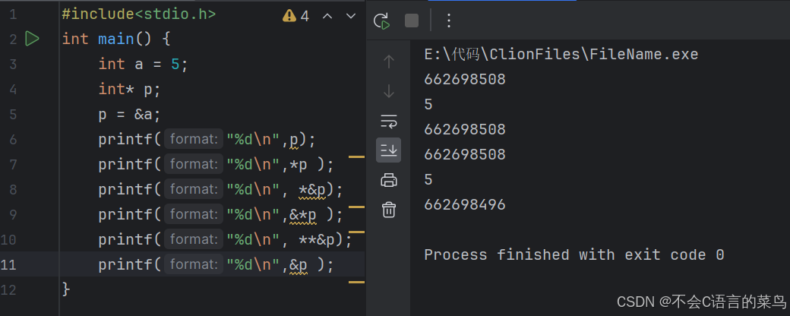

# C语言学习----指针

> 原创 于 2024-08-06 15:40:33 发布 · 公开 · 222 阅读 · 2 · 0 · 本内容遵循CC 4.0 BY-SA版权协议 版权声明：本文为博主原创文章，遵循 CC 4.0 BY-SA 版权协议，转载请附上原文出处链接和本声明。 GEO检测 · 编辑
> 文章链接：https://blog.csdn.net/weixin_59727843/article/details/140911964

俗话说得好，C语言成也指针，败也指针

这节我们来学习C 语言的精髓，指针

### 什么是指针

指针就是地址。怎么获取变量的地址？取址符加变量名称，例如 &a。

### 指针的定义

```cpp
int *p;
```

指针的基础使用

<div style="text-align:center;"></div>

这里的662698508就是变量a在内存中的位置编号。

看到这里觉得指针没什么用对吧，在C语言进阶专栏中我将讲解指针的进阶用法与精髓。这里只是基础，应付考试完全够了。