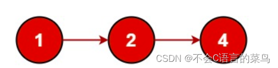

# 数据结构----链表

> 原创 已于 2024-07-17 14:43:43 修改 · 公开 · 560 阅读 · 3 · 8 · 本内容遵循CC 4.0 BY-SA版权协议 版权声明：本文为博主原创文章，遵循 CC 4.0 BY-SA 版权协议，转载请附上原文出处链接和本声明。 GEO检测 · 编辑
> 文章链接：https://blog.csdn.net/weixin_59727843/article/details/139546175

数据结构中我们常用的为线性表，树，图等

今天我们学习的是线性表的一种，链表

### 1.什么是链表

链表是一种只能从头开始遍历到尾的一种数据结构，链表由一个个结点（node）组成

，每个结点由两部分组成即指针域和数据域，指针域顾名思义就是指针（我们先讨论单向链表），这个指针指向下一个结点，数据域就是我们要保存的数据。

<div style="text-align:center;"></div>

这就是一个简单的链表，我们简单分析一下，结点1的指针是指向结点2的，结点2的指针是指向结点3的，结点1 的数据域是1，结点2的数据域是2，结点3的数据域的4

我们给出这个链表的部分代码

```cpp
struct node{
    int data;//数据域
    struct node*next;//指针域
};
```

这是用结构体定义每一个结点

之后开始初始化这个链表

### 2.链表的实现

通常来说 链表会有一个头节点，这个头节点一般不包含任何信息，当然你也可以写入一些本链表的其他信息

我们先定义头节点

structnode *head=malloc(sizeof(struct node));

struct node *node1=malloc(sizeof(struct node));

struct node *node2=malloc(sizeof(struct node));

struct node *node3=malloc(sizeof(struct node));

head->next=node1；

node1->data=1;

这样我们的头节点就已经写好了。

之后开始定义每一个节点以及下一个节点。

node1->next=node2;

node2->data=2;

node2->next=node3;

node3->data=4;

node3后就没有节点了，我们让它指向空（NULL）

node3->next=NULL;

这就是这个链表的简单实现。下一结我将更详细的讲解链表，以及常规的链表怎么写。