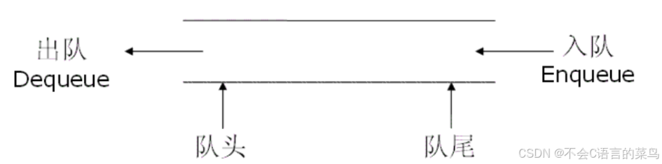
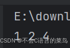

# 数据结构----队列

> 原创 已于 2024-07-19 16:23:53 修改 · 公开 · 619 阅读 · 15 · 3 · 本内容遵循CC 4.0 BY-SA版权协议 版权声明：本文为博主原创文章，遵循 CC 4.0 BY-SA 版权协议，转载请附上原文出处链接和本声明。 GEO检测 · 编辑
> 文章链接：https://blog.csdn.net/weixin_59727843/article/details/140549534

今天我们学习数据结构中线性表的队列。

### 1.什么是队列：

队列是一种先进先出（FIFO）的一种数据结构。与链表一样也是由一个个的节点组成。

只是我们在链表的添加和删除操作上加入了一点限制使得只能从队列的尾部（队尾）添加元素，只能从队列的头部（对头）删除元素

 

### 2.队列的实现：

#### 队列节点：

```cpp
struct queueListNode {
    int data;
    struct queueListNode *next;
};
```

#### 队列：

```cpp
struct queue {
    struct queueListNode *front;
    struct queueListNode *rear;
};
```

#### 队列中的方法：

从队尾添加元素：push

从队头删除元素：pop

获取队列的大小：getsize

判断队列是否为空：isEmpty

销毁队列：destroy

```cpp
void init(struct queue *q) {
    q->front = NULL;
    q->rear = NULL;
}
 
struct queueListNode *creatNode(int data) {
    struct queueListNode *cur = malloc(sizeof(struct queueListNode));
    cur->next = NULL;
    cur->data = data;
    return cur;
}
bool isEmpty(struct queue*q){
    return q->front==NULL;
}
void push(struct queue*q,int data) {
    struct queueListNode*cur= creatNode(data);
    if(isEmpty(q)){
        q->front=q->rear=cur;
    }else{
        q->rear->next=cur;
        q->rear=cur;
    }
}
void pop(struct queue*q){
    if(isEmpty(q)){
        return;
    }
   struct queueListNode*temp=q->front->next;
    free(q->front);
    q->front=temp;
}
int getFront(struct queue*q){
    return q->front->data;
}
int getRear(struct queue*q){
    return q->rear->data;
}
int getSize(struct queue*q){
    int count=0;
    for(struct queueListNode*cur=q->front;cur;cur=cur->next){
        count++;
    }
    return count;
}
void destroy(struct queue*q){
    if(isEmpty(q)){
        return;
    }
    while (q->front){
        pop(q);
    }
}
```

### 3.下面给出完整代码：

```cpp
 
#include "stdio.h"
#include "stdlib.h"
#include "stdbool.h"
struct queueListNode {
    int data;
    struct queueListNode *next;
};
struct queue {
    struct queueListNode *front;
    struct queueListNode *rear;
};
 
void init(struct queue *q) {
    q->front = NULL;
    q->rear = NULL;
}
 
struct queueListNode *creatNode(int data) {
    struct queueListNode *cur = malloc(sizeof(struct queueListNode));
    cur->next = NULL;
    cur->data = data;
    return cur;
}
bool isEmpty(struct queue*q){
    return q->front==NULL;
}
void push(struct queue*q,int data) {
    struct queueListNode*cur= creatNode(data);
    if(isEmpty(q)){
        q->front=q->rear=cur;
    }else{
        q->rear->next=cur;
        q->rear=cur;
    }
}
void pop(struct queue*q){
    if(isEmpty(q)){
        return;
    }
    struct queueListNode*temp=q->front->next;
    free(q->front);
    q->front=temp;
}
int getFront(struct queue*q){
    return q->front->data;
}
int getRear(struct queue*q){
    return q->rear->data;
}
int getSize(struct queue*q){
    int count=0;
    for(struct queueListNode*cur=q->front;cur;cur=cur->next){
        count++;
    }
    return count;
}
void destroy(struct queue*q){
    if(isEmpty(q)){
        return;
    }
    while (q->front){
        pop(q);
    }
}
int main(){
    struct queue *q= malloc(sizeof (struct queueListNode));
    init(q);
    push(q,1);
    push(q,2);
    push(q,3);
    push(q,4);
    printf("%d ", getFront(q));//1
    pop(q);
    printf("%d ", getFront(q));//2
    printf("%d ", getRear(q));//4
    destroy(q);
}
```

 

