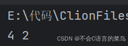

# 数据结构----栈

> 原创 已于 2024-07-19 17:47:05 修改 · 公开 · 287 阅读 · 9 · 3 · 本内容遵循CC 4.0 BY-SA版权协议 版权声明：本文为博主原创文章，遵循 CC 4.0 BY-SA 版权协议，转载请附上原文出处链接和本声明。 GEO检测 · 编辑
> 文章链接：https://blog.csdn.net/weixin_59727843/article/details/140555514

今天我们学习数据结构中线性表的栈

### 1.什么是栈：

栈与队列相反是先进后出的（FILO）的一种数据结构。与链表相同也是由一个一个节点组成。

我们重写队列中的方法改变队列的实现方式就能使用栈。 [队列](https://blog.csdn.net/weixin_59727843/article/details/140549534?spm=1001.2014.3001.5501) 

### 2.栈的实现：

#### 栈的节点

```csharp
struct stackNode{
    int data;
    struct stackNode*next;
};
```

#### 栈

```csharp
 
struct stack{
    struct stackNode*top;
};
```

#### 方法实现

```cobol
void init(struct stack*s){
    s->top=NULL;
}
bool isEmpty(struct stack*s){
    return s->top==NULL;
}
struct stackNode*creatNode(){
    struct stackNode *cur= malloc(sizeof (struct stackNode));
    cur->next=NULL;
    return cur;
}
void push(struct stack*s,int data){
    struct stackNode*cur=creatNode();
    cur->data=data;
    if(isEmpty(s)){
        s->top=cur;
    }else{
        cur->next=s->top;
        s->top=cur;
    }
}
void pop(struct stack*s){
    struct stackNode*temp=s->top->next;
    free(s->top);
    s->top=temp;
}
int getSize(struct stack*s){
    int count=0;
    for(struct stackNode*cur=s->top;cur;cur=cur->next){
        count++;
    }
    return count;
}
int getTop(struct stack*s){
    return s->top->data;
}
void destroy(struct stack*s){
    if(isEmpty(s)){
        return;
    }
    while(s){
        pop(s);
    }
}
```

### 完整代码：

```cobol
 
#include "stdio.h"
#include "stdlib.h"
#include "stdbool.h"
struct stackNode{
    int data;
    struct stackNode*next;
};
struct stack{
    struct stackNode*top;
};
void init(struct stack*s){
    s->top=NULL;
}
bool isEmpty(struct stack*s){
    return s->top==NULL;
}
struct stackNode*creatNode(){
    struct stackNode *cur= malloc(sizeof (struct stackNode));
    cur->next=NULL;
    return cur;
}
void push(struct stack*s,int data){
    struct stackNode*cur=creatNode();
    cur->data=data;
    if(isEmpty(s)){
        s->top=cur;
    }else{
        cur->next=s->top;
        s->top=cur;
    }
}
void pop(struct stack*s){
    struct stackNode*temp=s->top->next;
    free(s->top);
    s->top=temp;
}
int getSize(struct stack*s){
    int count=0;
    for(struct stackNode*cur=s->top;cur;cur=cur->next){
        count++;
    }
    return count;
}
int getTop(struct stack*s){
    return s->top->data;
}
void destroy(struct stack*s){
    if(isEmpty(s)){
        return;
    }
    while(s){
        pop(s);
    }
}
int main(){
    struct stack*s= malloc(sizeof (struct stack));
    init(s);
    push(s,1);
    push(s,2);
    push(s,3);
    push(s,4);
    printf("%d ", getTop(s));
    pop(s);
    pop(s);
    printf("%d", getTop(s));
    destroy(s);
    free(s);
    return 0;
}
```

#### 运行结果：

 

