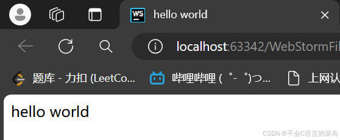

# 前端学习笔记-----第一天

> 原创 已于 2024-07-17 14:41:37 修改 · 公开 · 340 阅读 · 10 · 4 · 本内容遵循CC 4.0 BY-SA版权协议 版权声明：本文为博主原创文章，遵循 CC 4.0 BY-SA 版权协议，转载请附上原文出处链接和本声明。 GEO检测 · 编辑
> 文章链接：https://blog.csdn.net/weixin_59727843/article/details/140493874

### 1.web标准的构成：

结构：用于对网页元素的整理和分类（HTML）

表现：设置网页元素的版式，颜色，大小（CSS）

行为：网页的模型定义的和交互的编写（Js）

### 2.HTML的语法规范：

1.所有的标签必须放在<>内  <html></html>

2.大部分标签都是双标签，少部分为单标签。

#### 双标签的关系：

包含关系：

<head>

<title>title</title>

</head>

并列关系：

<head></head>

<body></body>

### 3.HTML基本结构标签：

<html></html>HTML文件的根标签，所有的HTML文件的代码都应包含在这个标签内。

<head></head>html文件的头部标签，主要包含文件的编码标准，标题，等

<title></title>标题标签，页面的标题

<boby></body>HTML文件的主体标签，HTML文件的大部分代码都写在这里。

### 4.hello world程序：

#### 代码：

```html
<html lang="en">
  <head>
      <title>hello world</title>
  </head>
  <body>
  hello world
  </body>
</html>
```

#### 运行截图：

<div style="text-align:center;"></div>

<div style="text-align:center;"></div>

今天就学到这里吧，明天我们学习HTML的常用标签。