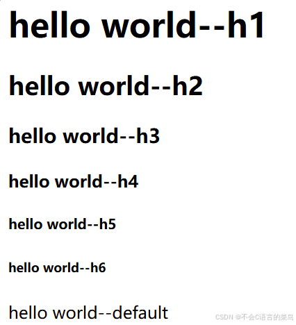
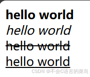
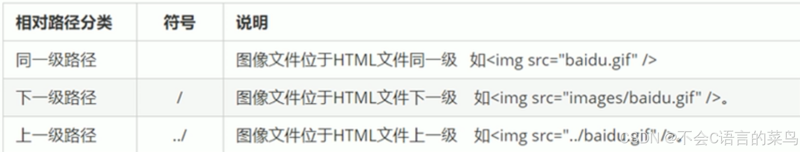
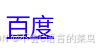
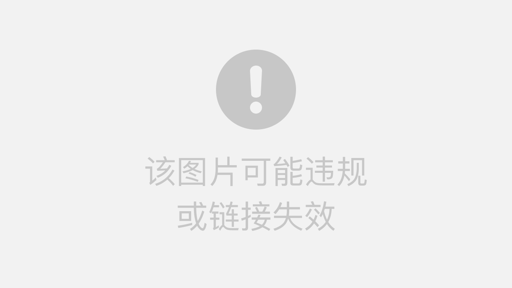

# 前端学习笔记----第二天（常用标签1）

> 原创 于 2024-07-19 14:48:20 发布 · 公开 · 338 阅读 · 3 · 7 · 本内容遵循CC 4.0 BY-SA版权协议 版权声明：本文为博主原创文章，遵循 CC 4.0 BY-SA 版权协议，转载请附上原文出处链接和本声明。 GEO检测 · 编辑
> 文章链接：https://blog.csdn.net/weixin_59727843/article/details/140522520

### 1.标题标签：

<h1></h1>

................

<h6></h6>

 

### 2.段落标签：

<p></p>

将文字分为若干个段落，更有层次感

### 3.换行标签

<br />

换行用的

### 4.文本格式化标签：

加粗：<strong></strong> <b></b>

倾斜：<em></em> <i></i>

删除线：<del></del> <s></s>

下划线：<ins></ins> <u></u>

当然我们不推荐使用这种用法，在CSS中将学习更先进的技术来实现。

<div style="text-align:center;"></div>

### 5.盒子标签：

<div></div>

div标签实际上是没有任何语义的，它只是一个容器，在没有CSS修饰的情况下对页面布局没有任何影响。

但是盒子模型在前端布局中占据重要地位，我们在css的学习中在深入了解。

### 6.图像标签：

注意图像标签是单标签。

格式：


其中path是图片的路径。

#### 路径：

目录文件夹和根目录：

目录文件夹：用来存放我们需要的素材如html文件，图片等的普通文件夹

根目录：打开目录文件夹的第一层被称为根目录

绝对路径：指文件的绝对位置，直达文件目录，通常以盘符开头，如D:\code\html等。

相对路径：以引用文件所在位置为参考，建立的目录路径

 

#### 特殊属性：

alt ：当图片加载不成功的时候显示的文字描述

title： 当鼠标指针移动到图片时的显示文字

width： 图片的宽度

height： 图片的宽度

border： 图片的边框距离（当然，我们任然不推荐使用这个属性，在CSS中我们将学习更先进的技术

### 7.超链接标签：

<a href="url">文字描述</a>

例如：

<a href="http://www.baidu.com">百度</a>

<div style="text-align:center;"></div>

点击百度可以跳转到百度首页

 

#### 锚点链接：

在超链接标签的中的href属性中使用#加id来实现

例如：

```html
<p id="one">first</p>
<p id="two">middle</p>
<p id="three">last</p>
<a href="#one">to first</a>
<a href="#two">to middle</a>
<a href="#three">to last</a>
```

今天就讲到这里，明天学习表格和表单。