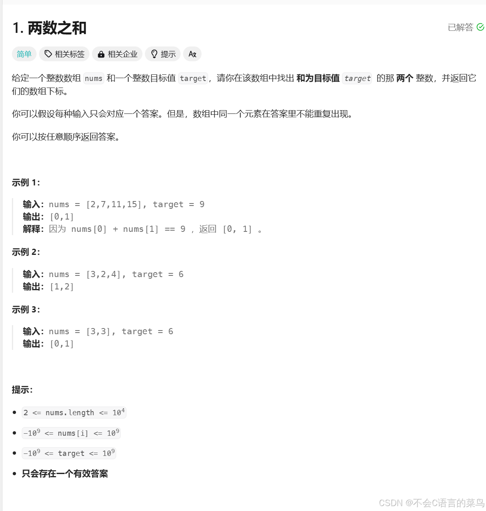

# leetcode----第一题

> 原创 已于 2024-07-29 13:56:13 修改 · 公开 · 327 阅读 · 9 · 0 · 本内容遵循CC 4.0 BY-SA版权协议 版权声明：本文为博主原创文章，遵循 CC 4.0 BY-SA 版权协议，转载请附上原文出处链接和本声明。 GEO检测 · 编辑
> 文章链接：https://blog.csdn.net/weixin_59727843/article/details/140769364

### 1.题目：

 

### 2.分析：

由题意：我们要找到两个下标使nums[i]+nums[j]==target；而且答案具有唯一性最简单的方法就是遍历数组（两层for循环找到两个下标i，j）；

### 3.实现：

```cobol
/**
 * Note: The returned array must be malloced, assume caller calls free().
 */
int* twoSum(int* nums, int numsSize, int target, int* returnSize){
for(int i=0;i<numsSize;i++){
    for(int j=i+1;j<numsSize;j++){
        if(nums[i]+nums[j]==target){
            *returnSize = 2;
                int* ans = (int*)malloc(sizeof(int) * 2);
                ans[0] = i; ans[1] = j;
                return ans;
        }
    }
}
*returnSize=0;
return NULL;
}
```