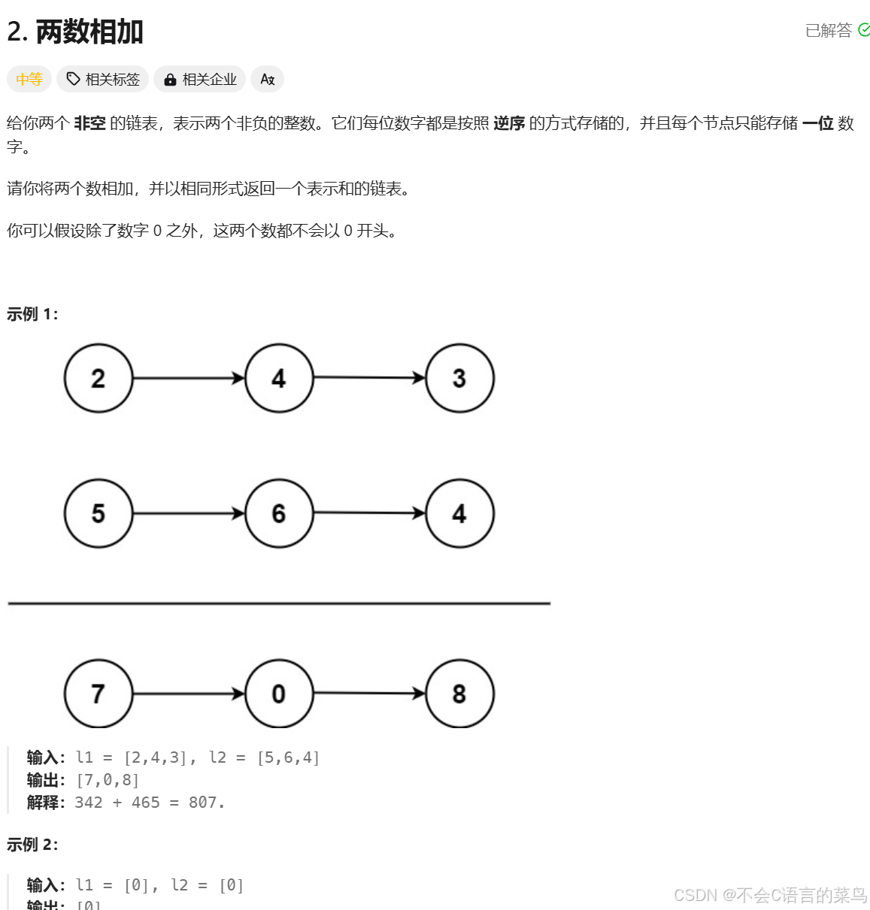

# leetcode----第二题

> 原创 已于 2025-08-16 09:40:55 修改 · 公开 · 247 阅读 · 1 · 0 · 本内容遵循CC 4.0 BY-SA版权协议 版权声明：本文为博主原创文章，遵循 CC 4.0 BY-SA 版权协议，转载请附上原文出处链接和本声明。 GEO检测 · 编辑
> 文章链接：https://blog.csdn.net/weixin_59727843/article/details/140769610

### 1.题目：

 

### 2.分析：

题目要求我们返回一个链表，并且给了我们两个链表，所以我们要写一个链表来存储每一位的数字，首先，我们遍历两条链表，将他们的对应的位数的数字相加，如果相加的结果大于9，则对10取余，剩下的就是当前位置的值，理所应当，下一位要加一（加法都学过的对吧？？不多解释）。

### 3.实现：

```cpp
/**
 * Definition for singly-linked list.
 * struct ListNode {
 *     int val;
 *     struct ListNode *next;
 * };
 */
struct ListNode* addTwoNumbers(struct ListNode* l1, struct ListNode* l2) {
   //链表头节点
   struct ListNode*head=malloc(sizeof(struct ListNode));
   //链表当前节点
   struct ListNode*cur=head;
   int t=0;
   //遍历链表
   while(l1||l2||t){
       if(l1){
           t+=l1->val;
           l1=l1->next;
       }
       if(l2){
           t+=l2->val;
           l2=l2->next;
       }
       //分配下一个节点
       cur->next=malloc(sizeof(struct ListNode)); 
       cur->next->val=t%10;
       cur->next->next=NULL;
       //更新节点位置
       cur=cur->next;
       t/=10;
    }
    return head->next;
}
```