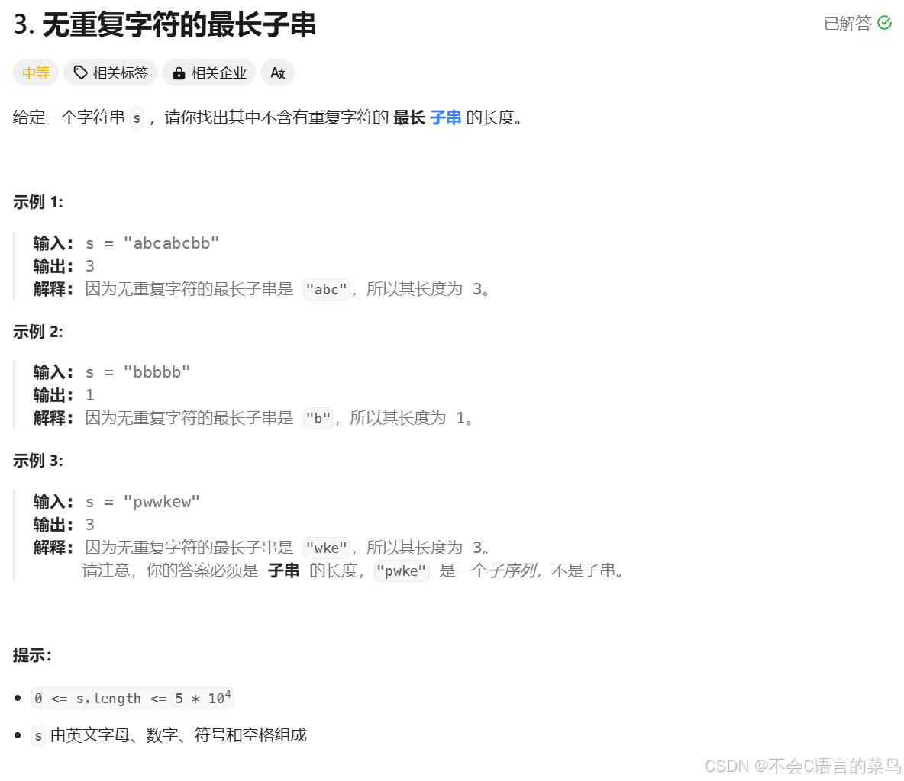

# leetcode----第三题

> 原创 已于 2024-07-29 20:17:31 修改 · 公开 · 458 阅读 · 4 · 9 · 本内容遵循CC 4.0 BY-SA版权协议 版权声明：本文为博主原创文章，遵循 CC 4.0 BY-SA 版权协议，转载请附上原文出处链接和本声明。 GEO检测 · 编辑
> 文章链接：https://blog.csdn.net/weixin_59727843/article/details/140779830

### 1.题目：

<div style="text-align:center;"></div>

### 2.分析：

首先，由题意，我们找的是子串，那么什么是子串？什么是子序列？

子串：串中任意个 **连续的字符** 组成的子序列称为该串的子串。

子序列：给定序列{Xn}，从中 **任意地选取** 无限项，按照原来的顺序组成的序列称为序列{Xn}的一个子序列。子序列是序列。通俗理解，序列就是在原来序列中找出一部分组成的序列。

由定义可知子串一定是子序列。

举个列子：串 123456中，

子串可以有，123，234，1，2，3，2345等（连续）

子序列可以有，134，15，156，245等（不连续）

注：453这种不算子序列。

了解子串后在看题目，找最长的不重复的子串，我们看到子串，子序列等问题首先想到 [滑动窗口](https://blog.csdn.net/weixin_59727843/article/details/140780201?csdn_share_tail=%7B%22type%22%3A%22blog%22%2C%22rType%22%3A%22article%22%2C%22rId%22%3A%22140780201%22%2C%22source%22%3A%22weixin_59727843%22%7D) 

### 3.实现：

```cpp
int lengthOfLongestSubstring(char * s){
    int low=0,len=strlen(s),fast=0;
    int result=0,count=0;
    //使用数组来判断这个字符是否出现过
    int temp[128]={0};
    while(fast<len){
        if(temp[s[fast]]==0){
            temp[s[fast]]=1;
            //扩大窗口
            fast++;
            count++;
            result=result>count?result:count;
        }
        else{
            temp[s[low]]=0;
            //缩小窗口
            low++;
            count--;
        }
    }
    return result;
}
```

我们用bool数组来代替int数组，得到下面的代码。

```cpp
int lengthOfLongestSubstring(char * s){
    int left=0,len=strlen(s);
    int result=0;
    bool temp[128]={false};
    for(int right=0;right<len;right++){
    while(temp[s[right]]){
        temp[s[left++]]=false;
    }
    result=((right-left+1>result)?right-left+1:result);
    temp[s[right]]=true;
    }
    return result;
}
```