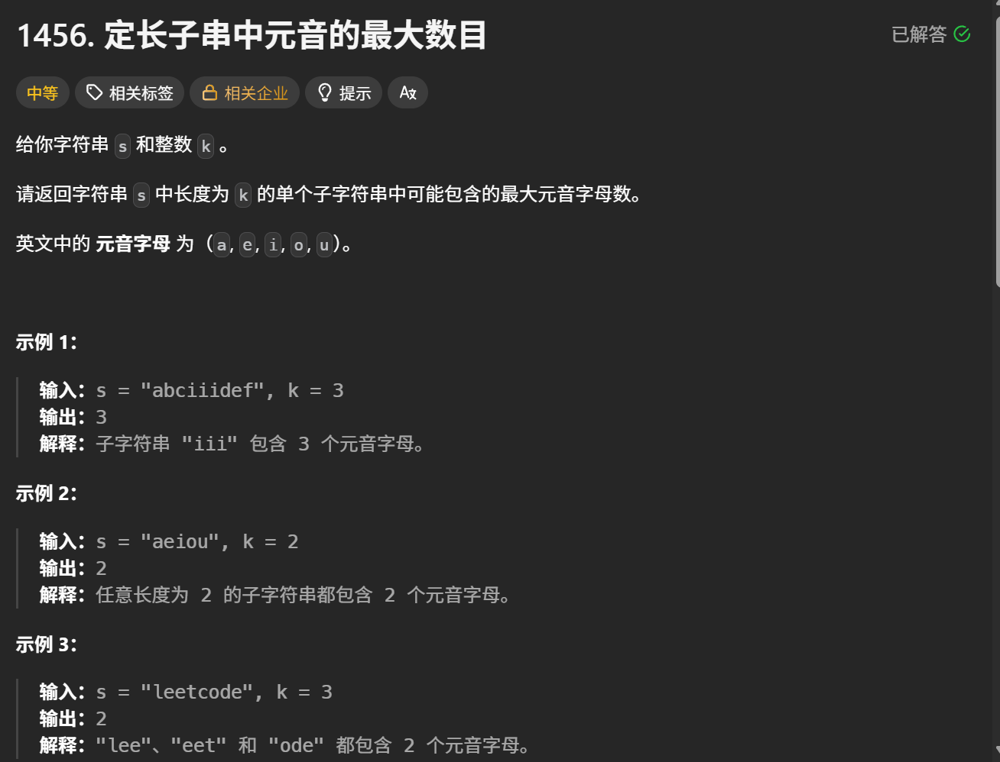

# leetcode1456. 定长子串中元音的最大数目

> 原创 于 2025-08-14 15:45:05 发布 · 公开 · 442 阅读 · 5 · 0 · 本内容遵循CC 4.0 BY-SA版权协议 版权声明：本文为博主原创文章，遵循 CC 4.0 BY-SA 版权协议，转载请附上原文出处链接和本声明。 GEO检测 · 编辑
> 文章链接：https://blog.csdn.net/weixin_59727843/article/details/150392582



这是一道典型的滑动窗口,虽然简单,但是任然有有很多可以注意的细节,

第一 为了节约资源,不必要每次都去切片一个字符串

例如abciiidef k=3,第一次切片为 abc,第二次切片为 bci,...然后拿着切片去判断有几个元音这其实是没必要的,会浪费资源.

第二判断是否为元音的时候为了追求性能(如C.rust)可以将这些元音变为字节(当然在这里没必要)

```rust
impl Solution {
    pub fn max_vowels(s: &str, k: i32) -> i32 {
        let chars: Vec<char> = s.chars().collect();
        let k = k as usize;
 
        if chars.len() < k {
            return 0;
        }
 
        // 计算第一个窗口的元音数量
        let mut current_vowels = 0;
        for i in 0..k {
            if Self::is_vowel(chars[i]) {
                current_vowels += 1;
            }
        }
 
        let mut max_vowels = current_vowels;
 
        // 滑动窗口：移除左边字符，添加右边字符
        for i in k..chars.len() {
            // 移除窗口左边的字符
            if Self::is_vowel(chars[i - k]) {
                current_vowels -= 1;
            }
            // 添加窗口右边的字符
            if Self::is_vowel(chars[i]) {
                current_vowels += 1;
            }
 
            max_vowels = max_vowels.max(current_vowels);
        }
 
        max_vowels
    }
 
    fn is_vowel(c: char) -> bool {
        matches!(c, 'a' | 'e' | 'i' | 'o' | 'u')
    }
```