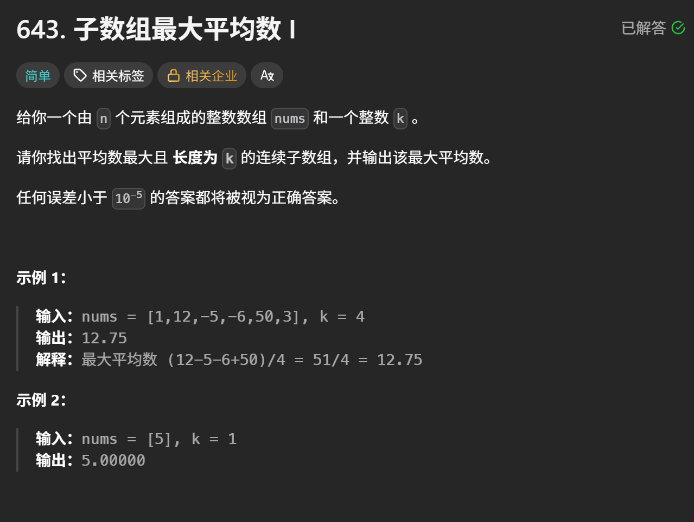

# leetcode 643. 子数组最大平均数 I

> 原创 于 2025-08-15 10:39:33 发布 · 公开 · 650 阅读 · 15 · 5 · 本内容遵循CC 4.0 BY-SA版权协议 版权声明：本文为博主原创文章，遵循 CC 4.0 BY-SA 版权协议，转载请附上原文出处链接和本声明。 GEO检测 · 编辑
> 文章链接：https://blog.csdn.net/weixin_59727843/article/details/150416931

## 子数组最大平均数 I

 

首先我们阅读题目,思考三个部分内容

- 已知条件

- 求什么

- 关键字

例如这道题:
已知条件为n个元素大小的数组,和一个整数k
求平均数
关键字: `平均数最大` , `长度为k` , `连续子数组` 

### 解题方法

我们的解题方法应该从关键字中去找,我们仔细分析关键字不难发现长度k为 `定长` 并且有 `连续子数组` 的条件
那么我们首先应该想到 [滑动窗口](https://blog.csdn.net/weixin_59727843/article/details/150415751?spm=1011.2124.3001.6209) 

### 具体细节

确定方法为 `滑动窗口` 后第一想到的就应该是每次选择一个窗口然后计算平均值,
然后对比每一组平均值哪组大,哪组就是答案

#### 代码

```rust
  pub fn find_max_average(nums: Vec<i32>, k: i32) -> f64 {
    let mut res = f64::MIN;
    for i in 0..nums.len() {
        if i as i32 + k > nums.len() as i32 {
            break;
        }
        let mut avg = 0.0;
        avg = Self::average(&nums, i as i32, (i as i32 + k));
        if avg > res {
            res = avg;
        }
    }
    res
}

fn average(nums: &Vec<i32>, start: i32, end: i32) -> f64 {
    let mut res = 0.0;
    let mut sum = 0.0;
    for i in start..end {
        sum += nums[i as usize] as f64;
    }
    res = (sum / (end - start) as f64);
    res
}
```

#### 优化方案

如果你拿着上面的代码去测试,你会发现超出时间限制,我们来分析哪里有问题
我们不难发现我们每次都要计算平均值,每次计算都要遍历数组,这就导致时间复杂度达到了O(n^2)
那么我们该怎么优化呢?
不难发现我们存在大量重复计算,因为每次计算和的时候其实都只减少了第一位,增加了最后一位,举个例子
计算 `[1,2,3,4] k=3` 时第一次的和为1+2+3,第二次为2+3+4,那么2+3就是重复计算的部分,所以我们只需要将重复的部分记录下来
避免重复计算这是典型的空间换时间的做法

##### 代码实现

```rust
 pub fn find_max_average(nums: Vec<i32>, k: i32) -> f64 {
        //计算第一次平均值
        let avg_and_sum = Self::average(&nums, 0, k);
        let mut avg = avg_and_sum.0;
        let mut sum = avg_and_sum.1;
        let mut res = avg;
        for i in 1..nums.len() {
            if i + k as usize > nums.len() {
                break;
            }
            sum -= nums[i - 1];
            sum += nums[i + k  as usize -1];
            avg = sum as f64 / k as f64;
            if res < avg {
                res = avg;
            }
        }
        res
    }

    fn average(nums: &Vec<i32>, start: i32, end: i32) -> (f64, i32) {
        let mut sum = 0.0;
        for i in start..end {
            sum += nums[i as usize] as f64;
        }
        (sum / (end - start) as f64, sum as i32)
    }
```

### 最后

其实这还不是最优秀的方法,如果我们再深入思考一下,在结合关键词 `k为定长` ,就会发现其实平均数的大小只与sum有关
只要sum越大,avg就越大,那么我们还可以简化为只需要找到sum最大的区间就行了

#### 代码

```rust
pub fn find_max_average(nums: Vec<i32>, k: i32) -> f64 {
        let k = k as usize;
        let mut sum: i64 = nums[..k].iter().map(|&x| x as i64).sum();
        let mut max_sum = sum;

        for i in k..nums.len() {
            sum += nums[i] as i64 - nums[i - k] as i64;
            max_sum = max_sum.max(sum);
        }

        max_sum as f64 / k as f64
    }
```