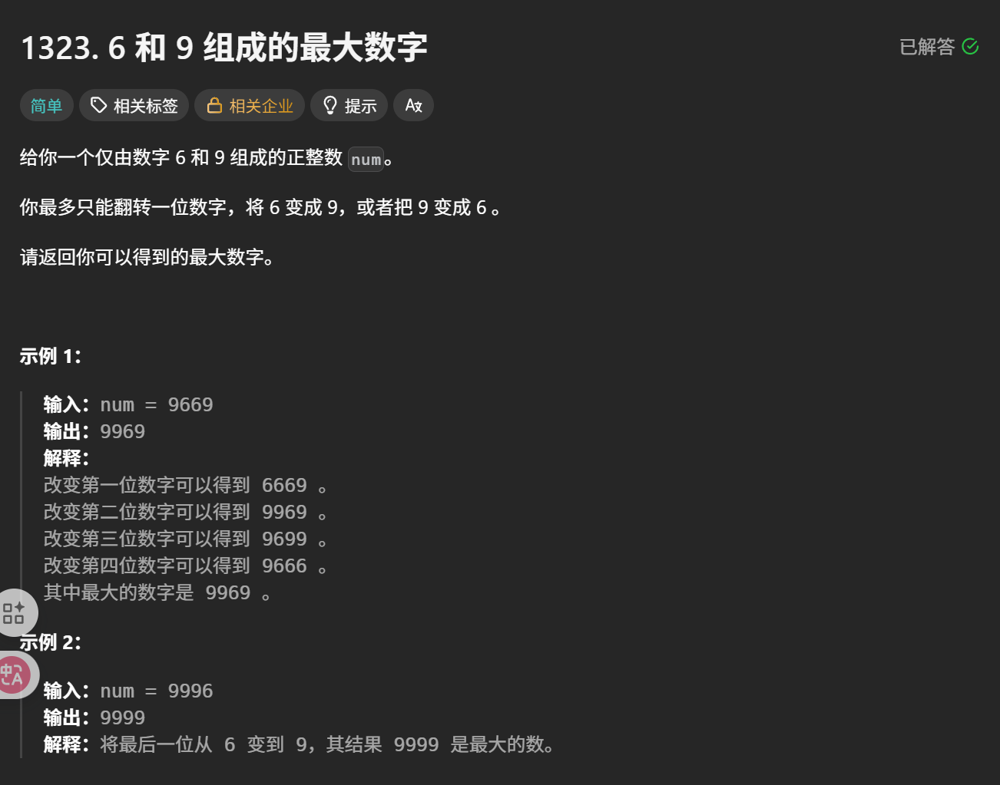

# 1323. 6 和 9 组成的最大数字

> 原创 于 2025-08-16 09:39:16 发布 · 公开 · 268 阅读 · 2 · 0 · 本内容遵循CC 4.0 BY-SA版权协议 版权声明：本文为博主原创文章，遵循 CC 4.0 BY-SA 版权协议，转载请附上原文出处链接和本声明。 GEO检测 · 编辑
> 文章链接：https://blog.csdn.net/weixin_59727843/article/details/150440369



这是一道简单题,我们思考后就会发现只需要将 最高位的6变为9就是最大的数了,这是典型的 [贪心算法](https://blog.csdn.net/weixin_59727843/article/details/150440464?spm=1011.2415.3001.5331) 

### 代码

```rust
 pub fn maximum69_number (num: i32) -> i32 {
        let num_str = num.to_string();
        let result_str = num_str.replacen('6', "9", 1); // 只替换第一个6
        i32::from_str(&result_str).unwrap()
    }
```