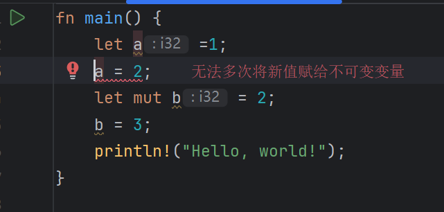
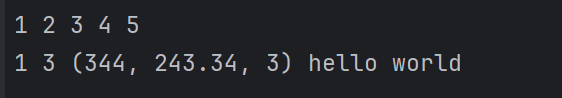

# rust的变量

> 原创 已于 2025-08-01 23:47:52 修改 · 公开 · 423 阅读 · 4 · 4 · 本内容遵循CC 4.0 BY-SA版权协议 版权声明：本文为博主原创文章，遵循 CC 4.0 BY-SA 版权协议，转载请附上原文出处链接和本声明。 GEO检测 · 编辑
> 文章链接：https://blog.csdn.net/weixin_59727843/article/details/149843686

## rust的变量

```rust
fn main() {
    let a = 1;
    a = 2; //错误,无法赋值给不可变变量
    let mut b = 2;
    b = 3;
    println!("Hello, world!");
}
```

 

如果你需要修改变量的值那么你需要在变量前面加 `mut` 关键字

### rust的变量类型

#### 基本类型

##### 整数

- i8

- i16

- i32

- i64

- i128

- u8

- u16

- u32

- u64

- u128

- isize

- usize

---

其中i表示有符号,u表示无符号

isize表是通过系统平台判断

##### 浮点数

- f32 32位浮点数

- f64 64位浮点数(默认)

##### bool

- bool (true | false)

##### 字符类型

- char 一个字符(unicode) 四个字节 Java是两个字节

##### 复合类型

- 元组 (Tuple)

- 数组 (Array)

##### 字符串

- &str - 字符串切片（不可变引用）

- String - 可变字符串（堆分配）

#### 4. 集合类型

##### 向量

- Vec - 动态数组

##### 哈希映射

- HashMap<K, V> - 键值对映射

##### 其他集合

- HashSet - 哈希集合

- BTreeMap<K, V> - 有序映射

- BTreeSet - 有序集合

- VecDeque - 双端队列

#### 5. 指针类型

##### 引用

- &T - 不可变引用

- &mut T - 可变引用

##### 智能指针

- Box - 堆分配的智能指针

- Rc - 引用计数智能指针

- Arc - 原子引用计数智能指针

- RefCell - 内部可变性

- Mutex - 互斥锁

- RwLock - 读写锁

##### 原始指针

- *const T - 不可变原始指针

- *mut T - 可变原始指针

#### 6. 函数类型

- fn - 函数指针

- Fn , FnMut , FnOnce - 闭包 trait

#### 7. 枚举类型 (Enum)

##### 标准库枚举

- Option - 可选值（ Some(T) 或 None ）

- Result<T, E> - 结果类型（ Ok(T) 或 Err(E) ）

##### 自定义枚举

```rust
enum Color {
    Red,
    Green,
    Blue,
}
```

#### 8. 结构体类型 (Struct)

##### 命名字段结构体

```rust
struct User {
    username: String,
    email: String,
    age: u32,
}
```

##### 元组结构体

```rust
struct Color(i32, i32, i32);
```

##### 单元结构体

```rust
struct Unit;
```

#### 9. 特殊类型

- () - 单元类型（空元组）

- ! - Never 类型（永不返回）

- dyn Trait - 动态分发的 trait 对象

### 示例代码

```rust
fn main() {
    let a = 1;
    let mut b = 2;
    b = 3;
    let tuple: (i32, f64, u8) = (344, 243.34, 3);
    let array: [i32; 5] = [1, 2, 3, 4, 5];
    let string = String::from("hello world");
    array.iter().for_each(|x| print!("{ } ", x));
    println!();
    println!("{:?} {:?} {:?} {}", a, b, tuple,string);
}

```

 

### 最后

rust有多种类型,如果你刚开始学习,那么你只需要掌握基本类型就行,剩下的类型我们将在后续学习
如果你学习过C,C++,Java,python等语言那么你应该很熟悉这些数据类型我不过多赘述